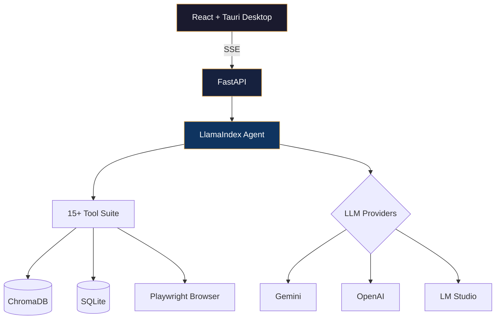

<!-- ═══════════════════════════════════════════════════════════════════════════ -->
<!-- ANIMATED HEADER BANNER -->
<!-- ═══════════════════════════════════════════════════════════════════════════ -->

<p align="center">
  
</p>

<!-- ═══════════════════════════════════════════════════════════════════════════ -->
<!-- TYPING ANIMATION -->
<!-- ═══════════════════════════════════════════════════════════════════════════ -->

<p align="center">
  <a href="https://git.io/typing-svg">
    
  </a>
</p>

<!-- ═══════════════════════════════════════════════════════════════════════════ -->
<!-- BADGES ROW -->
<!-- ═══════════════════════════════════════════════════════════════════════════ -->

<p align="center">
  
  &nbsp;
  <a href="https://github.com/aqibmehedi007?tab=followers">
    
  </a>
  &nbsp;
  <a href="https://github.com/aqibmehedi007?tab=repositories&sort=stargazers">
    
  </a>
</p>

<p align="center">
  <a href="https://linkedin.com/in/aqibmehedi"></a>
  <a href="https://aqibmehedi.com"></a>
  <a href="mailto:aqibcareer007@gmail.com"></a>
</p>

---

<!-- ═══════════════════════════════════════════════════════════════════════════ -->
<!-- ABOUT ME -->
<!-- ═══════════════════════════════════════════════════════════════════════════ -->

##  &nbsp;About Me

```yaml
name: Aqib Mehedi
location: Dhaka, Bangladesh
role: Senior AI & Mobile Solutions Architect
experience: 10+ years
focus: AI-Powered SaaS Platforms × Cross-Platform Mobile Apps

currently_building:
  - "CONTRAGRAVITON — Agentic AI Desktop Platform (FastAPI + React + Tauri + LlamaIndex)"
  - "AI-powered mobile apps at Kamal-Paterson Ltd (KP Cloud)"

industries_served:
  - FinTech        # Banking-grade currency exchange
  - EdTech         # Course platforms & exam systems
  - AgriTech       # AI farming with Bangla voice interaction
  - eCommerce      # Multi-vendor SaaS ecosystems
  - SaaS           # 9+ product ecosystem

languages_spoken:
  - Bengali (Native)
  - English (Professional — IELTS 6.5)
  - Hindi (Conversational)

fun_facts:
  - "🔭 Space exploration enthusiast"
  - "🎵 Music composer in spare time"
  - "📸 Photography lover"
  - "🧩 Puzzle solver & LLM tinkerer"
```

---

<!-- ═══════════════════════════════════════════════════════════════════════════ -->
<!-- FLAGSHIP PROJECT — CONTRAGRAVITON -->
<!-- ═══════════════════════════════════════════════════════════════════════════ -->

## 🧠 Flagship Project — CONTRAGRAVITON

> **An agentic AI desktop platform that acts as your autonomous "second brain."**

<table>
<tr>
<td width="60%">

**What it does:**
- 💬 Multi-turn AI chat with real-time thought streaming (SSE)
- 🌐 Autonomous browser automation via Playwright
- 📚 Local knowledgebase with semantic vector search (ChromaDB)
- 🖥️ Embedded code editor (Monaco) & terminal (xterm.js)
- 🔀 Visual workflow builder (React Flow)
- 🖼️ AI image generation
- 🔒 100% local-first — your data never leaves your machine

**Architecture:**
- **Frontend:** React 19 · TypeScript 6 · Vite 8 · Tauri 2 (Rust)
- **Backend:** FastAPI · LlamaIndex AgentWorkflow · Python
- **LLM Providers:** Gemini · OpenAI · OpenRouter · LM Studio (local)
- **Storage:** SQLite · ChromaDB · PARA-structured filesystem
- **State:** Zustand · SSE streaming · CSS Modules

</td>
<td width="40%">



</td>
</tr>
</table>

---

<!-- ═══════════════════════════════════════════════════════════════════════════ -->
<!-- TECH STACK -->
<!-- ═══════════════════════════════════════════════════════════════════════════ -->

## ⚡ Tech Stack

<table>
<tr>
<td align="center" width="20%"><b>🎯 Mobile</b></td>
<td align="center" width="20%"><b>🤖 AI / ML</b></td>
<td align="center" width="20%"><b>🌐 Frontend</b></td>
<td align="center" width="20%"><b>⚙️ Backend</b></td>
<td align="center" width="20%"><b>🛠️ DevOps</b></td>
</tr>
<tr>
<td align="center">


</td>
<td align="center">


</td>
<td align="center">


</td>
<td align="center">


</td>
<td align="center">


</td>
</tr>
</table>

---

<!-- ═══════════════════════════════════════════════════════════════════════════ -->
<!-- PROFESSIONAL EXPERIENCE TIMELINE -->
<!-- ═══════════════════════════════════════════════════════════════════════════ -->

## 💼 Professional Journey

```
2025 ─── Present    🏢 Senior Mobile App Developer (Flutter) — Kamal-Paterson Ltd (KP Cloud)
                    ├── Architected 5+ AI-powered mobile apps (Flutter + Firebase)
                    ├── Built Sleepy Owl Stories (GPT storytelling), Pocket Chef AI (CV cooking)
                    ├── Created Krishok AI — Bangla voice-powered farming platform
                    └── Led KP Learn — Udemy-style course platform with analytics

2023 ─── 2024      🏢 Senior Software Engineer (Flutter) — Technosoft Informatics LTD
                    ├── Tcard (NFC payments), Porua (multilingual eBooks)
                    ├── OnlyMCQ (exam prep), Saifurs Books (digital education)
                    └── End-to-end: planning → CI/CD → deployment → QA

2022 ─── 2023      🏢 Flutter App Developer — Danesh Exchange (Australia)
                    ├── Banking-grade app: AES encryption, OTP auth, root detection
                    └── Integrated with 3,000+ Australia Post locations

2017 ─── 2022      🚀 Freelance & Entrepreneurial Phase
                    ├── Architected SaaS ecosystem with 9+ products
                    ├── Mentored 40+ students in career prep & job placements
                    └── Won BASIS National ICT Awards 2018
```

---

<!-- ═══════════════════════════════════════════════════════════════════════════ -->
<!-- FEATURED PROJECTS -->
<!-- ═══════════════════════════════════════════════════════════════════════════ -->

## 🚀 Featured Projects

<table>
<tr>
<td width="50%">

### 🧠 CONTRAGRAVITON
**Agentic AI Desktop Platform**

Full-stack AI assistant with browser automation, knowledge management, code editing, workflow builder, and real-time streaming — all in a Tauri desktop app.

`FastAPI` `React 19` `Tauri 2` `LlamaIndex` `ChromaDB` `Playwright`

</td>
<td width="50%">

### 🌾 [Krishok AI](https://farmer.aqibmehedi.com/landing_page/)
**AI-Powered Farming Platform**

Farmer-friendly AI with single-tap Bangla voice interaction. Makes agricultural intelligence accessible to rural communities.

`Flutter` `Firebase` `GPT` `Voice AI` `Bangla NLP`

</td>
</tr>
<tr>
<td width="50%">

### 💱 [Danesh Exchange](https://apps.apple.com/us/app/danesh-exchange/id6450658342)
**Banking-Grade FinTech App**

Secure currency exchange with AES encryption, OTP authentication, root/jailbreak detection, integrated with 3,000+ Australia Post locations.

`Flutter` `AES Encryption` `Firebase` `REST APIs`

</td>
<td width="50%">

### 📚 [KP Learn](https://kplearn.aqibmehedi.com/)
**Online Course Platform**

Udemy-style learning platform with instructor dashboards, analytics, and cross-platform mobile experience.

`Flutter` `Laravel` `Vue.js` `MySQL` `Firebase`

</td>
</tr>
<tr>
<td width="50%">

### 🤖 [Echo AI Assistant](https://www.youtube.com/watch?v=DAEdfBPiQ14)
**Task Automation Tool**

AI-powered personal assistant for task automation and intelligent workflow management.

`Python` `AI/ML` `Automation` `NLP`

</td>
<td width="50%">

### 📖 [Porua](https://porua.org/)
**Bangla eBook Reader**

Multilingual digital reading platform serving the Bengali-speaking community with a rich, accessible reading experience.

`Flutter` `Laravel` `Firebase` `REST APIs`

</td>
</tr>
</table>

---

<!-- ═══════════════════════════════════════════════════════════════════════════ -->
<!-- GITHUB STATS -->
<!-- ═══════════════════════════════════════════════════════════════════════════ -->

## 📊 GitHub Analytics

<p align="center">
  
  
</p>

<p align="center">
  
</p>

<!-- ═══════════════════════════════════════════════════════════════════════════ -->
<!-- CONTRIBUTION GRAPH -->
<!-- ═══════════════════════════════════════════════════════════════════════════ -->

<p align="center">
  
</p>

---

<!-- ═══════════════════════════════════════════════════════════════════════════ -->
<!-- AWARDS & EDUCATION -->
<!-- ═══════════════════════════════════════════════════════════════════════════ -->

## 🏆 Awards & Education

<table>
<tr>
<td width="50%">

### 🏅 Awards
- **🥇 BASIS National ICT Awards 2018** — Winner (Smart Parking App, Innovation Category)
- **🏁 Banglalink IT Incubator 2.0** — Finalist (HomeFoodz Platform)

</td>
<td width="50%">

### 🎓 Education
- **BSc in Computer Science & Engineering** — Daffodil International University (2017)
  - CGPA: 3.64/4.0
  - Final Project: *Bangla Wall E (AI)* — Interactive AI-powered educational platform
- **Android Development Certification (SEIP)** — BASIS Institute (2018)

</td>
</tr>
</table>

---

<!-- ═══════════════════════════════════════════════════════════════════════════ -->
<!-- CONNECT -->
<!-- ═══════════════════════════════════════════════════════════════════════════ -->

## 🤝 Let's Connect

<p align="center">
  <a href="mailto:aqibcareer007@gmail.com"></a>
  <a href="https://linkedin.com/in/aqibmehedi"></a>
  <a href="https://aqibmehedi.com"></a>
  <a href="https://github.com/aqibmehedi007"></a>
</p>

<p align="center">
  <i>"I bridge the gap between complex AI backends and seamless mobile experiences — building products that feel alive."</i>
</p>

---

<!-- ═══════════════════════════════════════════════════════════════════════════ -->
<!-- 3D CONTRIBUTION MAP -->
<!-- ═══════════════════════════════════════════════════════════════════════════ -->

<p align="center">
  
</p>

<!-- ═══════════════════════════════════════════════════════════════════════════ -->
<!-- FOOTER WAVE -->
<!-- ═══════════════════════════════════════════════════════════════════════════ -->

<p align="center">
  
</p>
