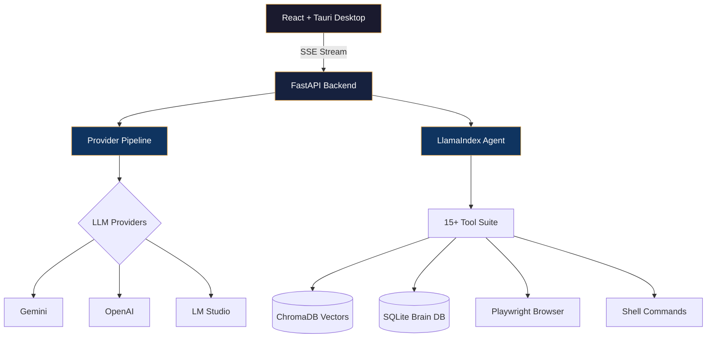

<!-- ═══════════════════════════════════════════════════════════════════════════ -->
<!-- ANIMATED HEADER -->
<!-- ═══════════════════════════════════════════════════════════════════════════ -->


<!-- ═══════════════════════════════════════════════════════════════════════════ -->
<!-- TYPING ANIMATION -->
<!-- ═══════════════════════════════════════════════════════════════════════════ -->

<p align="center">
  <a href="https://git.io/typing-svg">
    
  </a>
</p>

<!-- ═══════════════════════════════════════════════════════════════════════════ -->
<!-- BADGES ROW -->
<!-- ═══════════════════════════════════════════════════════════════════════════ -->

<p align="center">
  
  &nbsp;
  <a href="https://github.com/aqibmehedi007?tab=followers">
    
  </a>
  &nbsp;
  <a href="https://github.com/aqibmehedi007?tab=repositories&sort=stargazers">
    
  </a>
</p>

<p align="center">
  <a href="https://linkedin.com/in/aqibmehedi"></a>
  <a href="https://aqibmehedi.com"></a>
  <a href="mailto:aqibcareer007@gmail.com"></a>
</p>

---

<!-- ═══════════════════════════════════════════════════════════════════════════ -->
<!-- ABOUT ME -->
<!-- ═══════════════════════════════════════════════════════════════════════════ -->

##  &nbsp;About Me

```yaml
name: Aqib Mehedi
location: Dhaka, Bangladesh
role: Senior AI & Mobile Solutions Architect
experience: 10+ years
focus: AI-Powered SaaS Platforms x Cross-Platform Mobile Apps

currently_building:
  - "CONTRAGRAVITON — Agentic AI Desktop Platform (FastAPI + React + Tauri + LlamaIndex)"
  - "AI-powered mobile apps at Kamal-Paterson Ltd (KP Cloud)"

career_highlights:
  - "Architected a SaaS ecosystem with 9+ products (HRM, LMS, eCommerce, PM, Cards, Shop)"
  - "Built 15+ full-stack projects across 21 repositories"
  - "Won BASIS National ICT Awards 2018"
  - "Mentored 40+ students in career prep & job placements"

industries_served:
  - FinTech        # Banking-grade currency exchange (Danesh Exchange)
  - AgriTech       # AI farming with Bangla voice (Krishok AI, Tea Pest Intelligence)
  - HealthTech     # Antenatal & postnatal guidance app
  - EdTech         # LMS, exam systems, eBook platforms
  - eCommerce      # Multi-vendor SaaS ecosystems
  - Entertainment  # AI storytelling (Sleepy Owl Stories)
  - Enterprise     # HRM, project management, boardroom automation

languages_spoken:
  - Bengali (Native)
  - English (Professional — IELTS 6.5)
  - Hindi (Conversational)

fun_facts:
  - "🔭 Space exploration enthusiast"
  - "🎵 Music composer in spare time"
  - "📸 Photography lover"
  - "🧩 Puzzle solver & LLM tinkerer"
```

---

<!-- ═══════════════════════════════════════════════════════════════════════════ -->
<!-- TECH STACK -->
<!-- ═══════════════════════════════════════════════════════════════════════════ -->

## ⚡ Tech Stack

<table>
<tr>
<td align="center" width="20%"><b>🎯 Mobile & Desktop</b></td>
<td align="center" width="20%"><b>🤖 AI / ML</b></td>
<td align="center" width="20%"><b>🌐 Frontend</b></td>
<td align="center" width="20%"><b>⚙️ Backend</b></td>
<td align="center" width="20%"><b>🛠️ DevOps & Data</b></td>
</tr>
<tr>
<td align="center">


</td>
<td align="center">


</td>
<td align="center">


</td>
<td align="center">


</td>
<td align="center">


</td>
</tr>
</table>

---

<!-- ═══════════════════════════════════════════════════════════════════════════ -->
<!-- FLAGSHIP PROJECT — CONTRAGRAVITON -->
<!-- ═══════════════════════════════════════════════════════════════════════════ -->

## 🧠 Flagship: CONTRAGRAVITON — Agentic AI Desktop Platform

> **An autonomous "second brain" that can plan, research, browse the web, edit code, and execute commands — all through conversation.**

<table>
<tr>
<td width="55%">

**Core Capabilities:**
- 💬 Multi-turn AI chat with real-time thought streaming (SSE)
- 🌐 Autonomous browser automation via Playwright
- 📚 Local knowledgebase with semantic vector search (ChromaDB)
- 🖥️ Embedded code editor (Monaco) & terminal (xterm.js)
- 🔀 Visual workflow builder with node-based execution engine (React Flow)
- 🖼️ AI image generation via Flux models
- 🧊 3D knowledge vector map (Three.js + force-graph)
- 🔒 100% local-first — your data never leaves your machine

**Architecture:**
- **Frontend:** React 19 · TypeScript 6 · Vite 8 · Tauri 2 (Rust)
- **Backend:** FastAPI · LlamaIndex AgentWorkflow · 15+ agent tools
- **LLM Providers:** Gemini · OpenAI · OpenRouter · LM Studio (local)
- **Storage:** SQLite · ChromaDB · PARA-structured filesystem
- **Streaming:** Server-Sent Events with real-time reasoning visibility

</td>
<td width="45%">



</td>
</tr>
</table>

---

<!-- ═══════════════════════════════════════════════════════════════════════════ -->
<!-- FULL PROJECT PORTFOLIO -->
<!-- ═══════════════════════════════════════════════════════════════════════════ -->

## 🚀 Project Portfolio — 15+ Projects Across 21 Repositories

### 🤖 AI & Machine Learning

<table>
<tr>
<td width="50%">

#### 🧠 CONTRAGRAVITON
**Agentic AI Desktop Platform**

Full-stack AI assistant with browser automation, knowledge management, code editing, workflow builder, and real-time streaming — all in a Tauri desktop app.

`FastAPI` `React 19` `Tauri 2` `LlamaIndex` `ChromaDB` `Playwright` `Three.js`

</td>
<td width="50%">

#### 🔬 ImagineO — Dataset Generator & AI Vision Suite
**Agricultural Data Engineering Platform**

10-project AI suite: web harvesting, YOLO-based object extraction, synthetic dataset generation, model training (ViT, MobileNet), and universal multi-model disease diagnostics.

`Python` `YOLOv11` `Vision Transformers` `MobileNetV3` `OpenAI` `FAISS`

</td>
</tr>
<tr>
<td width="50%">

#### 🔍 Vector Image Search
**AI-Powered Similarity Search Engine**

High-performance image search using EfficientNetB0 feature extraction and FAISS for sub-millisecond similarity matching. Supports crop disease detection across corn, potato, rice, and wheat.

`FastAPI` `React + Vite` `EfficientNetB0` `FAISS` `AWS S3`

</td>
<td width="50%">

#### 🤖 [Echo AI Assistant](https://www.youtube.com/watch?v=DAEdfBPiQ14)
**Task Automation Tool**

AI-powered personal assistant for intelligent task automation and workflow management.

`Python` `AI/ML` `NLP` `Automation`

</td>
</tr>
</table>

### 🌾 AgriTech & HealthTech

<table>
<tr>
<td width="33%">

#### 🌾 [Krishok AI](https://farmer.aqibmehedi.com/landing_page/)
**AI Farming Platform**

GPT-4o powered agricultural assistant with Bangla voice interaction, crop disease diagnosis via camera, dealer locator, and weather integration. Serves rural Bangladesh.

`Flutter` `Laravel` `GPT-4o` `Firebase` `Google TTS`

</td>
<td width="33%">

#### 🍵 Tea Pest Intelligence
**Plantation Pest Management**

Replaces WhatsApp chaos with offline-first mobile capture, 3D geospatial heatmaps, gamified reporting, and automated treatment dispatch for Bangladesh's tea estates.

`Flutter` `FastAPI` `Next.js` `PostgreSQL + PostGIS` `AWS Lambda + SQS`

</td>
<td width="33%">

#### 🤰 Antental
**Maternal Health Guidance App**

Antenatal & postnatal guidance for Bangladesh — WHO/UNICEF-backed content, personalized pregnancy journeys, offline mode, emergency features, and AI-generated learning content.

`Flutter` `Laravel` `MySQL` `Firebase`

</td>
</tr>
</table>

### 🏢 KP Cloud SaaS Ecosystem — 9+ Products

<table>
<tr>
<td width="33%">

#### 📚 [KP Learn](https://kplearn.aqibmehedi.com/)
**Learning Management System**

Udemy-style LMS with course creation, quizzes, certificates, instructor dashboards, video management, and monetization.

`PHP` `CodeIgniter` `MySQL` `JavaScript`

</td>
<td width="33%">

#### 🛒 KP Commerce
**Multi-Vendor eCommerce CMS**

Full eCommerce ecosystem: admin panel, seller dashboard, customer app, deliveryman app, built-in POS, multi-language & multi-currency.

`Laravel 10` `Flutter` `MySQL` `PHP 8.2`

</td>
<td width="33%">

#### 👥 KP HRM
**HR & Payroll Management**

Recruitment to retirement: payroll automation, attendance, leave management, KPI tracking, timesheets, finance, helpdesk, and training modules.

`Laravel` `PHP 8.2` `MySQL` `JavaScript`

</td>
</tr>
<tr>
<td width="33%">

#### 📋 KP Task
**Project Management & Collaboration**

Kanban boards, time tracking, invoicing, client portals, ticketing, built-in chat, and multi-role dashboards.

`CodeIgniter` `PHP 8.0` `MySQL` `JavaScript`

</td>
<td width="33%">

#### 🛍️ KP Shop
**Digital Marketplace**

Multi-vendor digital product sales with cloud storage (AWS S3, DigitalOcean, Storj), social logins, Pusher notifications, and reviewer panel.

`Laravel` `PHP 8.x` `MySQL` `AWS S3` `Pusher`

</td>
<td width="33%">

#### 💳 KP Cards
**Digital Business Card Builder SaaS**

Multi-user vCard platform with customizable templates, QR codes, real-time editing, subscription plans, and glassmorphic dark theme.

`Laravel` `PHP 8.1` `MySQL` `JavaScript`

</td>
</tr>
<tr>
<td width="33%">

#### 🌐 KPSpace
**Multipurpose Agency Platform**

Laravel 12 agency script with pre-designed layouts, SASS styling, RTL support, multilingual (Bengali), e-commerce, and invoice templates.

`Laravel 12` `PHP 8.x` `MySQL` `SASS`

</td>
<td width="33%" colspan="2">

#### 🔗 Synapse Link
**Boardroom Automation System**

Zero-friction conference room appliance: 1-click Zoom/Teams launch, OBS-powered laptop presentation, IT panic button with Slack/Teams webhooks, glassmorphic kiosk UI.

`React` `Tailwind CSS v4` `Framer Motion` `Python` `OBS Studio`

</td>
</tr>
</table>

### 📱 Consumer Apps

<table>
<tr>
<td width="33%">

#### 🦉 [Sleepy Owl Stories](https://play.google.com/store/apps/details?id=com.kpcloud.bedtime_app)
**AI Bedtime Storytelling**

Personalized AI stories with character customization, moral themes, Chibi art generation, multi-language TTS narration, and background music. Published on Google Play.

`Flutter` `PHP` `MySQL` `GPT` `DeepAI` `Google TTS`

</td>
<td width="33%">

#### 🍳 Pocket Chef AI
**AI Cooking Assistant**

Recipe generation from available ingredients, voice-controlled cooking, smart pantry management with expiry tracking, meal planning, and camera-based ingredient scanning.

`Flutter` `Laravel` `GPT-3.5` `DeepAI` `Firebase`

</td>
<td width="33%">

#### 💱 [Danesh Exchange](https://apps.apple.com/us/app/danesh-exchange/id6450658342)
**Banking-Grade FinTech App**

Secure currency exchange with AES encryption, OTP auth, root/jailbreak detection. Integrated with 3,000+ Australia Post locations.

`Flutter` `Firebase` `AES Encryption` `REST APIs`

</td>
</tr>
<tr>
<td width="33%">

#### 📖 [Porua](https://porua.org/)
**Bangla eBook Reader**

Multilingual digital reading platform serving the Bengali-speaking community.

`Flutter` `Laravel` `Firebase` `REST APIs`

</td>
<td width="33%" colspan="2">

#### 📝 OnlyMCQ & Saifurs Books
**EdTech Platforms**

Exam preparation platform and digital content platform for Saifurs educational materials.

`Flutter` `Laravel` `Firebase` `REST APIs`

</td>
</tr>
</table>

---

<!-- ═══════════════════════════════════════════════════════════════════════════ -->
<!-- PROFESSIONAL EXPERIENCE TIMELINE -->
<!-- ═══════════════════════════════════════════════════════════════════════════ -->

## 💼 Professional Journey

```
2025 ─── Present    🏢 Senior Mobile App Developer (Flutter) — Kamal-Paterson Ltd (KP Cloud)
                    ├── Architected 5+ AI-powered mobile apps (Flutter + Firebase)
                    ├── Built Sleepy Owl Stories, Pocket Chef AI, Krishok AI
                    ├── Created Tea Pest Intelligence & ImagineO AI Vision Suite
                    ├── Led KP Learn, KP Commerce, KP HRM, KP Task, KP Cards, KP Shop
                    └── Designed Synapse Link boardroom automation system

2023 ─── 2024      🏢 Senior Software Engineer (Flutter) — Technosoft Informatics LTD
                    ├── Tcard (NFC payments), Porua (multilingual eBooks)
                    ├── OnlyMCQ (exam prep), Saifurs Books (digital education)
                    └── End-to-end: planning → CI/CD → deployment → QA

2022 ─── 2023      🏢 Flutter App Developer — Danesh Exchange (Australia)
                    ├── Banking-grade app: AES encryption, OTP auth, root detection
                    └── Integrated with 3,000+ Australia Post locations

2017 ─── 2022      🚀 Freelance & Entrepreneurial Phase
                    ├── Architected SaaS ecosystem with 9+ products
                    ├── Mentored 40+ students in career prep & job placements
                    └── Won BASIS National ICT Awards 2018
```

---

<!-- ═══════════════════════════════════════════════════════════════════════════ -->
<!-- GITHUB STATS -->
<!-- ═══════════════════════════════════════════════════════════════════════════ -->

## 📊 GitHub Analytics

<p align="center">
  
  
</p>

<p align="center">
  
</p>

<p align="center">
  
</p>

---

<!-- ═══════════════════════════════════════════════════════════════════════════ -->
<!-- AWARDS & EDUCATION -->
<!-- ═══════════════════════════════════════════════════════════════════════════ -->

## 🏆 Awards & Education

<table>
<tr>
<td width="50%">

### 🏅 Awards
- **🥇 BASIS National ICT Awards 2018** — Winner (Smart Parking App, Innovation Category)
- **🏁 Banglalink IT Incubator 2.0** — Finalist (HomeFoodz Platform)

</td>
<td width="50%">

### 🎓 Education
- **BSc in Computer Science & Engineering** — Daffodil International University (2017)
  - CGPA: 3.64/4.0
  - Final Project: *Bangla Wall E (AI)* — Interactive AI-powered educational platform
- **Android Development Certification (SEIP)** — BASIS Institute (2018)

</td>
</tr>
</table>

---

<!-- ═══════════════════════════════════════════════════════════════════════════ -->
<!-- CONNECT -->
<!-- ═══════════════════════════════════════════════════════════════════════════ -->

## 🤝 Let's Connect

<p align="center">
  <a href="mailto:aqibcareer007@gmail.com"></a>
  <a href="https://linkedin.com/in/aqibmehedi"></a>
  <a href="https://aqibmehedi.com"></a>
  <a href="https://github.com/aqibmehedi007"></a>
</p>

<p align="center">
  <i>"I bridge the gap between complex AI backends and seamless mobile experiences — building products that feel alive."</i>
</p>

---

<!-- ═══════════════════════════════════════════════════════════════════════════ -->
<!-- 3D CONTRIBUTION MAP -->
<!-- ═══════════════════════════════════════════════════════════════════════════ -->

<p align="center">
  
</p>

<!-- ═══════════════════════════════════════════════════════════════════════════ -->
<!-- FOOTER -->
<!-- ═══════════════════════════════════════════════════════════════════════════ -->


