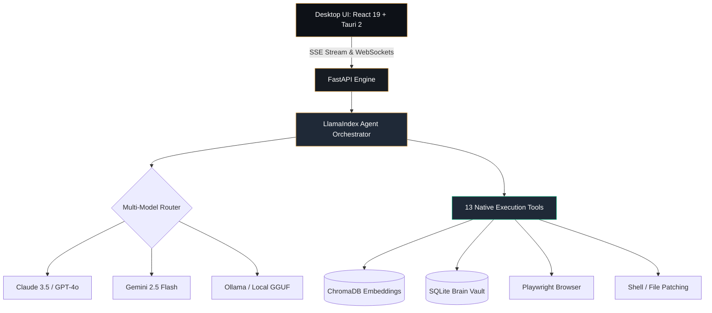

<!-- ═══════════════════════════════════════════════════════════════════════════ -->
<!-- ANIMATED HEADER -->
<!-- ═══════════════════════════════════════════════════════════════════════════ -->


<!-- ═══════════════════════════════════════════════════════════════════════════ -->
<!-- TYPING ANIMATION -->
<!-- ═══════════════════════════════════════════════════════════════════════════ -->

<p align="center">
  <a href="https://git.io/typing-svg">
    
  </a>
</p>

<!-- ═══════════════════════════════════════════════════════════════════════════ -->
<!-- BADGES & QUICK LINKS -->
<!-- ═══════════════════════════════════════════════════════════════════════════ -->

<p align="center">
  
  &nbsp;
  <a href="https://github.com/aqibmehedi007?tab=followers">
    
  </a>
  &nbsp;
  <a href="https://github.com/aqibmehedi007?tab=repositories&sort=stargazers">
    
  </a>
</p>

<p align="center">
  <a href="https://linkedin.com/in/aqibmehedi"></a>
  <a href="https://aqibmehedi.com"></a>
  <a href="mailto:aqibcareer007@gmail.com"></a>
  <a href="https://contragraviton.aqibmehedi.com/"></a>
</p>

---

<!-- ═══════════════════════════════════════════════════════════════════════════ -->
<!-- ABOUT ME -->
<!-- ═══════════════════════════════════════════════════════════════════════════ -->

##  &nbsp;About Me

```yaml
name: Aqib Mehedi
location: Dhaka, Bangladesh (Open to 100% Remote Global Roles)
role: Senior AI & Mobile Solutions Architect
experience: 9+ years (Continuous verifiable trajectory 2017 – Present)
focus: Autonomous AI Agents x Banking-Grade Mobile Platforms x Distributed Cloud Systems

currently_building:
  - "CONTRAGRAVITON — Autonomous Agentic AI Desktop Platform (FastAPI + React 19 + Tauri 2 + LlamaIndex)"
  - "Enterprise AI Vision & Telemetry Systems at Kamal-Paterson Ltd (KP Cloud)"

career_highlights:
  - "Architected and shipped 30+ production platforms across FinTech, AgriTech, AI, and SaaS"
  - "Winner of the prestigious BASIS National ICT Award 2018 (E-PARKING IoT Platform)"
  - "Champion of Banglalink IT Incubator 2.0 (HOMEFOODZ Marketplace)"
  - "Trained & mentored 150+ software engineers across Bangladesh (SEIP / BITM)"
  - "Engineered banking-grade FinTech processing $5,000+ daily across 60+ currencies (Danesh Exchange)"

industries_served:
  - FinTech        # Banking-grade FX, AES-256 GCM, root detection, 3,000+ Australia Post branches
  - AgriTech       # Dialect-aware Bangla voice AI, on-device foliar vision, PostGIS spatial GIS
  - Agentic AI     # Autonomous pair programmers, multi-agent RAG, 4-bit GGUF quantization
  - Enterprise     # Zero-trust document operating systems (McFTP), boardroom automation (KP Nexus)
  - Mobile & IoT   # Hardware NFC payments (Tcard), smart parking IoT gateways, BLE hardware
  - EdTech & DRM   # Hardware-bound cryptographic eBook security & DRM (Porua.org)

languages_spoken:
  - Bengali (Native)
  - English (Full Professional Proficiency — IELTS 6.5)
  - Hindi (Conversational)

philosophies:
  - "High-performance systems should feel invisible, deterministic, and alive."
  - "Local-first data sovereignty: user privacy and cryptographic security must come by default."
```

---

<!-- ═══════════════════════════════════════════════════════════════════════════ -->
<!-- TECH STACK ARSENAL -->
<!-- ═══════════════════════════════════════════════════════════════════════════ -->

## ⚡ Technical Arsenal

<table>
<tr>
<td align="center" width="20%"><b>🤖 Agentic AI & ML</b></td>
<td align="center" width="20%"><b>📱 Mobile & Desktop</b></td>
<td align="center" width="20%"><b>🌐 Frontend & Web</b></td>
<td align="center" width="20%"><b>⚙️ Backend & APIs</b></td>
<td align="center" width="20%"><b>🛠️ Cloud & Databases</b></td>
</tr>
<tr>
<td align="center">


</td>
<td align="center">


</td>
<td align="center">


</td>
<td align="center">


</td>
<td align="center">


</td>
</tr>
</table>

---

<!-- ═══════════════════════════════════════════════════════════════════════════ -->
<!-- FLAGSHIP ARCHITECTURE — CONTRAGRAVITON -->
<!-- ═══════════════════════════════════════════════════════════════════════════ -->

## 🧠 Flagship Architecture: CONTRAGRAVITON

> **Autonomous Desktop Agentic Process Orchestrator (APO) featuring 13 native CLI tools, dual-path vector indexing, non-destructive AST diff patching, and local-first data sovereignty.**

<table>
<tr>
<td width="55%">

**Core Capabilities:**
- 🛠️ **13 Native Tool Engine:** Filesystem indexing, regex ripgrep, AST diff patching, shell command execution, live web search, and sandboxed browser subagents.
- 💬 **Live SSE Reasoning Stream:** Real-time visibility into the agent's chain-of-thought, tool invocation parameters, and execution artifacts.
- 📚 **Dual-Path Vector RAG:** ChromaDB semantic embeddings paired with PARA-structured local memory vaults.
- 🌐 **Autonomous Browser Subagent:** Playwright-driven headless & headed browser navigation, form interaction, and multi-step research.
- 🖥️ **Integrated Developer IDE:** Embedded Monaco code editor, xterm.js terminal emulator, and node-based workflow builder (React Flow).
- 🔒 **100% Local Sovereignty:** Zero proprietary cloud dependencies; compatible with Ollama, LM Studio, OpenAI, Gemini, and Claude.

**Stack:**
- **Desktop Host:** Tauri 2 (Rust) + React 19 + TypeScript 5.8
- **Agentic Engine:** FastAPI + Python 3.11 + LlamaIndex AgentWorkflow
- **Vector & Storage:** ChromaDB + SQLite + Local Filesystem

</td>
<td width="45%">


```mermaid
graph TB
    A[Desktop UI: React 19 + Tauri 2] -->|SSE Stream & WebSockets| B[FastAPI Engine]
    B --> C[LlamaIndex Agent Orchestrator]
    C --> D{Multi-Model Router}
    D --> E[Claude 3.5 / GPT-4o]
    D --> F[Gemini 2.5 Flash]
    D --> G[Ollama / Local GGUF]
    C --> H[13 Native Execution Tools]
    H --> I[(ChromaDB Embeddings)]
    H --> J[(SQLite Brain Vault)]
    H --> K[Playwright Browser]
    H --> L[Shell / File Patching]
    
    style A fill:#0d1117,stroke:#e0a040,color:#fff
    style B fill:#161b22,stroke:#e0a040,color:#fff
    style C fill:#1f2937,stroke:#e0a040,color:#fff
    style H fill:#1f2937,stroke:#10b981,color:#fff
```

</td>
</tr>
</table>

---

<!-- ═══════════════════════════════════════════════════════════════════════════ -->
<!-- FEATURED HIGH-IMPACT PLATFORMS -->
<!-- ═══════════════════════════════════════════════════════════════════════════ -->

## 🚀 Featured Production Platforms (Curated Selection)

### 🤖 1. Flagship AI & Agentic Systems

<table>
<tr>
<td width="50%">

#### 🧠 [CONTRAGRAVITON](https://contragraviton.aqibmehedi.com/)
**Autonomous Agentic Process Orchestrator**
- Operates 13 native CLI tools across file indexing, regex grep, AST diff patching, and browser subagents.
- Dual-path semantic memory (ChromaDB) with live SSE reasoning streams and visual node workflows.
- `FastAPI` `React 19` `Tauri 2 (Rust)` `LlamaIndex` `Playwright` `ChromaDB`

</td>
<td width="50%">

#### 🌾 [Krishok AI](https://farmer.aqibmehedi.com/landing_page/)
**Multimodal Dialect-Aware Agricultural Intelligence**
- Voice-first agricultural platform for rural Bangladesh with dialect-aware Bangla Speech-to-Text.
- Camera-based visual crop disease diagnosis running reliably on low-bandwidth 2G/3G networks.
- `Flutter` `Python` `GPT-4o` `Google Speech API` `Firebase` `Laravel`

</td>
</tr>
<tr>
<td width="50%">

#### 🦙 [Agri-Llama & MChat Offline LLM](https://huggingface.co/aqibmehedi/agri-llama)
**On-Device 4-Bit GGUF Quantized Language Models**
- Fine-tuned Bengali agricultural LLM quantized to 4-bit GGUF, operating on 2GB RAM edge devices.
- Native Android Kotlin client running on-device Vulkan/NNAPI acceleration with zero internet.
- `PyTorch` `LLaMA-3` `GGUF` `llama.cpp` `Kotlin` `Vulkan API` `C++ NDK`

</td>
<td width="50%">

#### 🔬 ImagineO & Vector Image Search
**AI Computer Vision & Similarity Search Suite**
- 10-project agricultural AI suite for dataset extraction, ViT / MobileNetV3 model training, and sub-millisecond similarity matching via FAISS.
- `FastAPI` `FAISS` `EfficientNetB0` `YOLOv11` `PyTorch` `React + Vite`

</td>
</tr>
</table>

### 🔒 2. FinTech, Hardware & Enterprise Systems

<table>
<tr>
<td width="50%">

#### 💱 [Danesh Exchange Australia](https://apps.apple.com/us/app/danesh-exchange/id6450658342)
**Banking-Grade Foreign Currency Exchange Platform**
- High-security FinTech application processing 5,000+ daily transactions across 60+ global currencies.
- Hardened with AES-256 GCM encryption, biometric OTP authentication, SSL pinning, and root/jailbreak detection.
- Integrated nationwide with 3,000+ Australia Post retail distribution branches.
- `Flutter` `Dart` `AES-256 GCM` `REST APIs` `Biometrics` `Australia Post API`

</td>
<td width="50%">

#### 🍵 [Tea Pest Intelligence Platform](https://github.com/Kamal-Paterson/Tea_Pest_Intelligence)
**Spatial GIS & WebGL 3D Plantation Ecosystem**
- Replaced manual field paper reports across commercial tea estates with offline-first mobile capture.
- Executive WebGL 3D isometric geospatial heatmap powered by PostGIS with automated chemical dispatch.
- `Flutter (Offline)` `Next.js` `FastAPI` `PostGIS` `WebGL` `Docker` `AWS`

</td>
</tr>
<tr>
<td width="50%">

#### 💳 Tcard / Digi-Pass
**Virtual Contactless NFC Payment & Access Protocol**
- Contactless payments and enterprise access credentials using hardware NFC chips (Android ISO-DEP & iOS CoreNFC).
- Real-time merchant tokenized transaction handshakes with sub-100ms processing and analytics.
- `Flutter` `Android ISO-DEP` `iOS CoreNFC` `Laravel REST API` `Redis` `MySQL`

</td>
<td width="50%">

#### 📁 [McFTP](https://github.com/Kamal-Paterson/McFTP)
**Zero-Trust Private Enterprise Document OS**
- Departmental document operating system with cryptographic isolation, FTPS, and automated OCR key-value extraction.
- Private conversational knowledge querying over scanned invoices with complete audit logs.
- `TypeScript` `Node.js` `Tesseract OCR` `Local LLMs` `SQLite` `Prisma`

</td>
</tr>
<tr>
<td width="50%">

#### 📖 [Porua.org](https://porua.org/)
**Hardware-Bound Cryptographic DRM eBook Platform**
- Secure digital publishing distribution platform with hardware-bound DRM and on-the-fly memory stream decryption.
- Built-in piracy defenses, screenshot protection, and multi-currency international author royalties.
- `Flutter` `Custom DRM Module` `AES-256` `WebAssembly` `Node.js`

</td>
<td width="50%">

#### 🖥️ [Synapse Link (KP Nexus)](https://github.com/Kamal-Paterson/Synapse-Link)
**Zero-Install Boardroom Automation Hub**
- Conference room appliance enabling zero-install browser display casting, one-touch Zoom/Teams launch, and private stream routing.
- `React` `Tailwind CSS` `WebSockets` `WebRTC` `Python` `OBS Studio`

</td>
</tr>
</table>

### 🏆 3. Award-Winning Platforms

<table>
<tr>
<td width="50%">

#### 🥇 [E-PARKING (Shared Economy Smart Parking)](https://aqibmehedi.com)
**Winner — BASIS National ICT Award 2018 (Innovation Category)**
- Shared-economy smart parking ecosystem enabling property owners to monetize unused parking spaces.
- Dynamic encrypted QR gate triggers, IoT microcontroller gate barriers, automated duration billing, and in-app navigation.
- `Native Android` `Flutter` `Laravel REST API` `IoT Microcontrollers` `Redis` `MySQL`

</td>
<td width="50%">

#### 🏆 [HOMEFOODZ (Culinary Merchant Marketplace)](https://aqibmehedi.com)
**Champion — Banglalink IT Incubator 2.0 (Seed Funded)**
- Food delivery marketplace connecting urban households with certified home chefs across Dhaka.
- Real-time kitchen order tracking, automated dispatch routing, and multi-party escrow revenue splitting.
- `React Native` `Flutter` `Node.js` `Express` `MongoDB` `Firebase Cloud Messaging`

</td>
</tr>
</table>

---

<!-- ═══════════════════════════════════════════════════════════════════════════ -->
<!-- PROFESSIONAL EXPERIENCE TIMELINE -->
<!-- ═══════════════════════════════════════════════════════════════════════════ -->

## 💼 Professional Trajectory (2017 – Present)

```
2025 ─── Present    🏢 Senior Software Architect & Mobile Lead — Kamal-Paterson Ltd (KP Cloud)
                    ├── Leading core architecture across AI Agentic platforms, Mobile apps & Cloud
                    ├── Shipped Contragraviton, Krishok AI, Tea Pest Intelligence & ImagineO Suite
                    ├── Directing enterprise platforms: McFTP, Synapse Link, and KP SaaS ecosystem
                    └── Technology Stack: Flutter, FastAPI, Python, React 19, Tauri 2, PostGIS, AWS

2023 ─── 2024      🏢 Senior Software Engineer (Flutter & Systems) — Technosoft Informatics LTD
                    ├── Engineered Tcard (contactless NFC payment), Porua.org (DRM eBook platform)
                    ├── Shipped OnlyMCQ (high-throughput exam prep) & Saifurs Digital Platform
                    ├── Established automated CI/CD release pipelines (Codemagic, GitHub Actions)
                    └── Technology Stack: Flutter, Dart, Android NDK, iOS CoreNFC, AES-256, Laravel

2022 ─── 2023      🏢 Lead Mobile App Developer — Danesh Exchange (Australia)
                    ├── Built banking-grade FX mobile platform with AES-256 GCM & biometric auth
                    ├── Integrated nationwide cash pickup via 3,000+ Australia Post retail branches
                    ├── Enforced PCI-DSS compliance, root/jailbreak detection & zero-trust API security
                    └── Technology Stack: Flutter, Dart, REST APIs, Security Hardening, AusPost APIs

2018 ─── 2022      🚀 Independent Technology Consultant & Software Architect
                    ├── Appointed SEIP Technical Trainer at BITM (2018–2020), mentoring 150+ engineers
                    ├── Winner of the BASIS National ICT Award 2018 for E-PARKING IoT Platform
                    ├── Champion of Banglalink IT Incubator 2.0 for HOMEFOODZ Marketplace
                    └── Architected enterprise SaaS applications, custom CRMs, and payment gateways

2017                🎓 BSc in Computer Science & Engineering — Daffodil International University
                    └── Graduated with High Distinction (CGPA: 3.64 / 4.00) • Finalist for Bangla Wall-E AI
```

---

<!-- ═══════════════════════════════════════════════════════════════════════════ -->
<!-- GITHUB ANALYTICS -->
<!-- ═══════════════════════════════════════════════════════════════════════════ -->

## 📊 GitHub Analytics & Code Velocity

<p align="center">
  
  
</p>

<p align="center">
  
</p>

<p align="center">
  
</p>

---

<!-- ═══════════════════════════════════════════════════════════════════════════ -->
<!-- AWARDS & HONORS -->
<!-- ═══════════════════════════════════════════════════════════════════════════ -->

## 🏆 Honors, Awards & Certifications

<table>
<tr>
<td width="50%">

### 🏅 National Honors & Awards
- **🥇 Winner — BASIS National ICT Awards 2018**
  *Category:* Innovation in Smart City & IoT (E-PARKING Platform)
- **🏆 Champion — Banglalink IT Incubator 2.0**
  *Category:* Digital Marketplace with Venture Incubation (HOMEFOODZ)

</td>
<td width="50%">

### 🎓 Academic & Professional Credentials
- **BSc in Computer Science & Engineering (2017)**
  *Daffodil International University* — **CGPA: 3.64 / 4.00**
  *Thesis:* AI Wall-E — Autonomous Computer Vision & Edge Robotics
- **SEIP Certified Lead Technical Trainer (2018)**
  *BASIS Institute of Technology & Management (BITM)*

</td>
</tr>
</table>

---

<!-- ═══════════════════════════════════════════════════════════════════════════ -->
<!-- CONNECT & SOCIALS -->
<!-- ═══════════════════════════════════════════════════════════════════════════ -->

## 🤝 Let's Collaborate

<p align="center">
  <a href="mailto:aqibcareer007@gmail.com"></a>
  <a href="https://linkedin.com/in/aqibmehedi"></a>
  <a href="https://aqibmehedi.com"></a>
  <a href="https://github.com/aqibmehedi007"></a>
</p>

<p align="center">
  <i>"I engineer autonomous AI pipelines, resilient mobile architectures, and zero-trust cloud systems that scale to millions and deliver measurable business value."</i>
</p>

<!-- ═══════════════════════════════════════════════════════════════════════════ -->
<!-- FOOTER WAVE -->
<!-- ═══════════════════════════════════════════════════════════════════════════ -->


